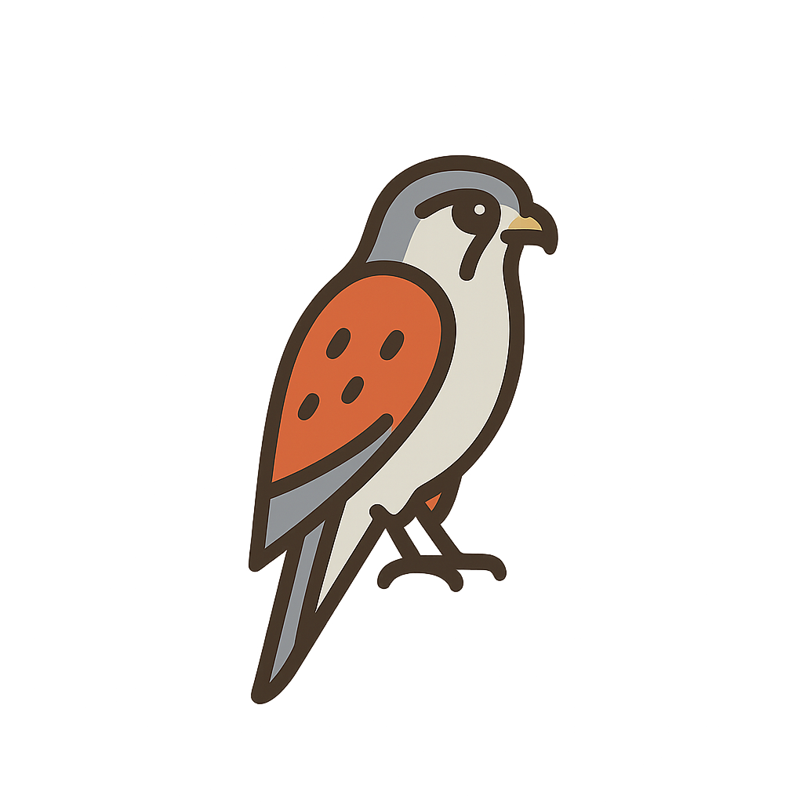

<div align="center">



# Kestrel

**High-Performance MISP-Compliant Threat Intelligence Feed Server**

[](https://golang.org/)
[](LICENSE)

Lightweight, self-hosted IOC feed distribution engine. Serves structured MISP-compatible JSON feeds and TXT-formatted blocklists for Pi-hole, AdGuard, firewalls, proxies, and DNS sinkhole systems.

**Designed for speed, simplicity, and data-source agnosticism** — Kestrel runs entirely on your own infrastructure.

[Features](#features) • [Quick Start](#quick-start) • [Use Cases](#use-cases) • [API](#api-endpoints) • [Testing](TESTING.md)

</div>

---

## Overview

Kestrel is a self-hosted threat intelligence distribution platform that makes sharing IOCs (Indicators of Compromise) simple and efficient. Whether you're running a security team, managing enterprise DNS filtering, or building custom threat feeds, Kestrel provides:

- **MISP-compliant JSON feeds** for threat intelligence platforms
- **TXT blocklists** for Pi-hole, AdGuard, firewalls, and DNS sinkholes
- **Flexible storage** with in-memory caching and Redis/Valkey backends
- **Domain validation** to ensure IOCs are active and reachable
- **API key management** with SQLite persistence and optional external sync
- **Simple deployment** as a single static Go binary

## Features

- ⚡ **Blazing Fast** - Built with Go, Valkey/Redis, and in-memory caching
- 🎯 **Fully Data-Driven** - Feeds created automatically via ingestion, no config files needed
- 🛣️ **Dynamic Paths** - Access feeds at ANY URL structure - feed name extracted from path
- 🔐 **Role-Based Access** - Admin-only ingestion, metadata-driven feed access control
- 🧠 **Flexible Storage** - In-memory (dev/testing) or Valkey/Redis (production)
- 🌐 **API Key Management** - Built-in generation with SQLite persistence
- ✅ **Domain Validation** - DNS (A/AAAA/CNAME) and HTTP/HTTPS connectivity checks
- 📊 **MISP Compliant** - Standard event format, manifest, and attributes
- 📜 **Free & Paid Feeds** - Configurable per feed via ingestion metadata
- 🐳 **Docker Ready** - Compose setup with Valkey included
- 🧱 **Simple Deployment** - Single binary + Redis/Valkey + optional SQLite

## Use Cases

### 🛡️ Threat Intelligence Sharing
Distribute IOCs across your security infrastructure using standard MISP feeds. Kestrel acts as a central distribution point for threat intelligence, allowing security tools to consume feeds programmatically.

### 🏢 Enterprise DNS Filtering
Deploy organization-wide DNS blocklists to Pi-hole, AdGuard, or custom DNS resolvers. Update blocklists in real-time as new threats are identified, protecting all devices on your network.

### 🔍 SIEM Integration
Feed threat indicators directly into your SIEM platform via MISP-compatible JSON. Correlate IOCs with logs and alerts to identify compromised systems faster.

### 🔬 Security Research
Host your own private threat intelligence feeds for research purposes. Validate domains before adding them to ensure accuracy and reduce false positives.

### 🌐 Custom Threat Feeds
Build specialized feeds for specific threat types, geographic regions, or industry sectors. Support multiple free (public, community) and paid (premium, enterprise) access models.

## Quick Start

```bash
# 1. Build
go build -o kestrel ./cmd/kestrel

# 2. Generate admin API key
./kestrel -generate-key
# Output: Generated API key: kestrel_abc123...

# 3. Start server with admin key
ADMIN_API_KEY=kestrel_abc123... ./kestrel

# 4. Ingest IOC to create feed
curl -X POST http://localhost:8080/api/ioc \
  -H "X-API-Key: kestrel_abc123..." \
  -H "Content-Type: application/json" \
  -d '{"domain":"malicious.com","category":"Malware","feed":"community","access_level":"free"}'

# 5. Access feed at ANY path structure
curl http://localhost:8080/list/pihole/community.txt
curl http://localhost:8080/feeds/community.txt
curl http://localhost:8080/any/custom/path/community.txt
```

## Configuration

See [.env.example](.env.example) for all options:

```bash
STORAGE_TYPE=memory           # memory (dev) or valkey (prod)
VALKEY_ADDR=localhost:6379
LISTEN_ADDR=:8080
ENABLE_VALIDATION=true        # Validate domains before adding
ADMIN_API_KEY=kestrel_xxx     # Admin key for IOC ingestion
```

**Fully Data-Driven**: Feeds are created automatically when you ingest IOCs. No configuration files needed!

## API Endpoints

| Method | Endpoint | Auth | Description |
|--------|----------|------|-------------|
| `GET` | `/healthz` | No | Health check |
| `GET` | `/*any/path/feedname.txt` | Conditional | **Dynamic feed access** - Any path structure works! |
| `POST` | `/api/ioc` | Admin | Submit IOC (creates feeds automatically) |
| `GET` | `/misp/manifest.json` | Yes | MISP manifest |
| `GET` | `/misp/events/:id.json` | Yes | MISP event details |
| `POST` | `/api/admin/generate-key` | Admin | Generate new API key |
| `POST` | `/api/admin/accounts` | Admin | Add account |
| `GET` | `/api/admin/accounts/:key` | Admin | Get account details |
| `DELETE` | `/api/admin/accounts/:key` | Admin | Remove account |

**Dynamic Feed Paths**: Feed name is extracted from the last URL segment. All paths work:
```
/list/pihole/community.txt    → feed: "community"
/feeds/community.txt           → feed: "community"
/any/custom/path/community.txt → feed: "community"
```

**Authentication**:
- **Admin endpoints**: Require API key with `plan: "admin"`
- **Free feeds** (set via `access_level: "free"` during ingestion): No auth required
- **Paid feeds** (default or `access_level: "paid"`): Use `X-API-Key` header, `Authorization: Bearer`, or `?apikey=` query param

**Validation Modes**:
- `?validate=dns` - Check for A, AAAA, or CNAME records
- `?validate=http` - Verify HTTP/HTTPS connectivity
- `?validate=full` - Both DNS and HTTP validation

## Examples

### Create a Free Community Feed
```bash
# Ingest IOC with admin key - creates "community" feed as free
curl -X POST http://localhost:8080/api/ioc \
  -H "X-API-Key: kestrel_admin_key" \
  -H "Content-Type: application/json" \
  -d '{
    "domain": "malicious.com",
    "category": "Malware",
    "comment": "Community reported C2",
    "feed": "community",
    "access_level": "free"
  }'

# Access at ANY path structure - no auth required!
curl http://localhost:8080/list/pihole/community.txt
curl http://localhost:8080/feeds/community.txt
curl http://localhost:8080/blocklists/dns/community.txt
```

### Create a Paid Premium Feed
```bash
# Ingest IOC - "paid" is the default access level
curl -X POST http://localhost:8080/api/ioc?validate=dns \
  -H "X-API-Key: kestrel_admin_key" \
  -H "Content-Type: application/json" \
  -d '{
    "domain": "apt-threat.com",
    "category": "APT",
    "comment": "Enterprise threat intelligence",
    "feed": "premium"
  }'

# Requires authentication to access
curl http://localhost:8080/list/enterprise/premium.txt?apikey=kestrel_user_key
```

### Consume MISP Feed
```bash
# Get manifest
curl http://localhost:8080/misp/manifest.json \
  -H "X-API-Key: kestrel_user_key"

# Get specific event
curl http://localhost:8080/misp/events/<event-id>.json \
  -H "X-API-Key: kestrel_user_key"
```

### Dynamic Path Examples
```bash
# Same feed, different paths - ALL work!
curl http://localhost:8080/list/pihole/community.txt
curl http://localhost:8080/list/adguard/community.txt
curl http://localhost:8080/feeds/community.txt
curl http://localhost:8080/blocklists/dns/sinkhole/community.txt
curl http://localhost:8080/security/feeds/public/community.txt
curl http://localhost:8080/custom/path/community.txt
```

### Add to Pi-hole
Navigate to **Settings → Blocklists** in Pi-hole and add:
```
http://your-server:8080/list/pihole/community.txt
```

### Firewall / DNS Sinkhole Integration
```bash
# Periodic fetch for firewall rules
curl -s http://localhost:8080/blocklists/firewall/premium.txt?apikey=YOUR_KEY > /etc/blocklist.txt
```

## Docker Deployment

```bash
# Start with Valkey
docker-compose up -d

# Generate admin key
docker exec kestrel ./kestrel -generate-key

# Add key to database
docker exec kestrel sqlite3 /data/kestrel.db \
  "INSERT INTO accounts VALUES ('YOUR_KEY', 'admin@example.com', 'admin', 1);"
```

## Architecture

```
+-----------------------+
| External Key Source   |  ← Optional: any HTTPS API for subscriber management
+----------+------------+
           |
           v
+----------v------------+
|     Kestrel (Go)      |
|  - HTTP/HTTPS         |
|  - Valkey/Redis       |
|  - SQLite fallback    |
+----------+------------+
           |
   ┌───────┼─────────────────────┐
   │       │                     │
   v       v                     v
MISP JSON Feeds     TXT Blocklists     API Ingestion
(/misp/...)         (/feeds/...)       (POST /api/ioc)
```

## Feed Configuration

Configure multiple free feeds via environment variable:

```bash
# Default: only 'public' is free
FREE_FEEDS=public

# Multiple free feeds
FREE_FEEDS=public,community,research

# All feeds require auth (empty list)
FREE_FEEDS=
```

Any feed not in `FREE_FEEDS` requires API key authentication.

## Performance

- **In-memory event caching** for instant MISP feed delivery
- **Concurrent request handling** via Gin framework
- **Valkey/Redis** for distributed deployments
- **SQLite** for persistent API key storage with zero config
- **Minimal allocations** in hot code paths

## Testing

```bash
# Basic compliance tests
./test/test_kestrel.sh

# Generic feeds test
./test/test_feeds.sh

# Authenticated API tests
KESTREL_API_KEY=your-key ./test/test_with_auth_simple.sh
```

See [TESTING.md](TESTING.md) for comprehensive test documentation and MISP compliance verification.

## Project Structure

```
kestrel/
├── cmd/kestrel/          # Application entry point
├── internal/
│   ├── config/          # Configuration management
│   ├── storage/         # Storage backends (memory, valkey)
│   ├── auth/            # Authentication & key management
│   ├── validation/      # Domain validation (DNS, HTTP)
│   ├── misp/            # MISP event handling
│   └── handlers/        # HTTP request handlers
├── test/                # Test scripts
├── .env.example         # Configuration template
├── docker-compose.yml   # Docker setup
└── Dockerfile           # Container image
```

## CLI Flags

```bash
./kestrel -help           # Show help
./kestrel -version        # Show version
./kestrel -generate-key   # Generate API key
```

## License

Custom Attribution License - See [LICENSE](LICENSE)

**TL;DR**: Free to use with attribution required. Include "Powered by Kestrel by PigeonSec" or link to this repo.

---

<div align="center">

Made by [Karl Machleidt](https://github.com/pigeonsec) / **PigeonSec**

⭐ Star this repo if you find it useful!

[Report Issues](https://github.com/pigeonsec/kestrel/issues) • [View License](LICENSE) • [Read Docs](TESTING.md)

</div>
